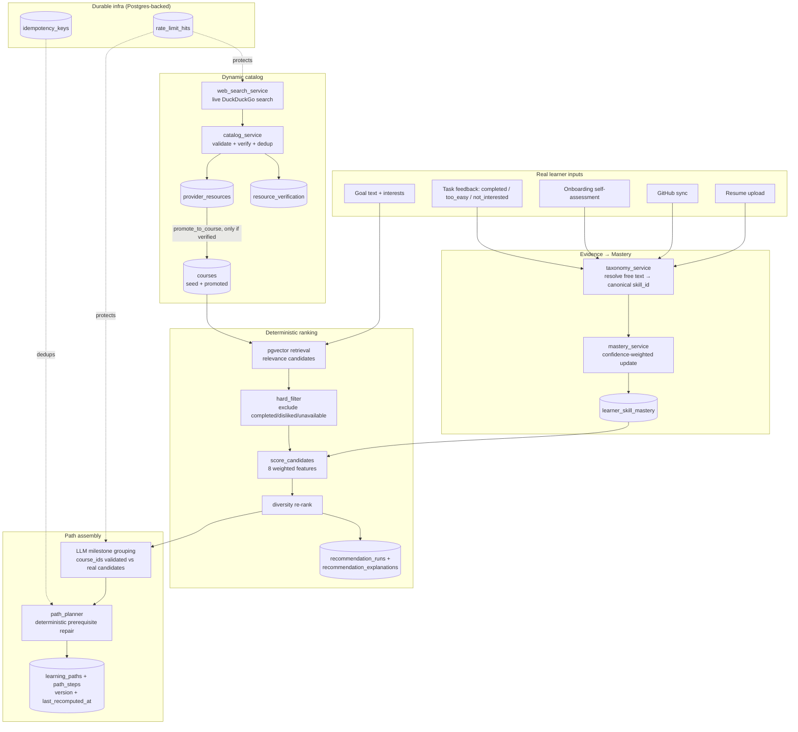

# PathFinder Platform Audit — Remediation Report

This document is the deliverable for the "Super Master Prompt" platform
audit: a prioritized remediation plan, architecture, the explicit list of
removed mock/static production paths, a migration plan that preserves
existing user data, and a final verification report. It complements (does
not replace) `docs/security_audit.md`, which is the living record of the
earlier, narrower security-focused audit rounds.

**Scope honesty, stated up front**: the original audit prompt described a
multi-month platform rebuild (paid provider-API integrations, a full
Redis/real-time event architecture, ML offline-eval dashboards). This
document reports what was actually built and verified, and is explicit
about the two real infrastructure constraints that shaped several
decisions: **no paid course-provider API credentials** exist for this
project, and **no Redis/shared-cache instance is provisioned** (single EC2
container, no infra-provisioning access in this engagement). Both
constraints are handled by building the closest honest equivalent with what
is actually available (the app's own live web search as a real, verified
"provider adapter"; Postgres as the durable, shared store) rather than
fabricating an integration that doesn't exist.

---

## 1. Prioritized remediation plan — status

| # | Finding | Status | Where |
|---|---|---|---|
| P0 | Mock users/auth/roadmap activatable via localStorage in production | **Fixed** | `AuthContext.jsx`, `ProtectedRoute.jsx`, `useRoadmap.js`, `apiClient.js` — gated behind `import.meta.env.DEV`, verified absent from the built production bundle |
| P0 | Recommender only retrieves from ~80 seeded courses | **Partially fixed** | `catalog_service.py` formalizes live web search as a real, verified, provenance-tracked provider adapter (`provider_resources` → `courses`); no paid partner-API ingestion (no credentials available) |
| P0 | Confidence/mastery stored but never ranked | **Fixed** | `learner_skill_mastery` model + `ranking_engine.py`; wired into every real evidence source |
| P0 | Resume evidence not weighted in ranking | **Fixed** | `mastery_service.update_mastery_from_resume`, wired into resume upload |
| P0 | `/api/roadmap/rerecommend` had no rate limiter | **Fixed** | `Depends(rate_limit(...))` added, Postgres-backed |
| P0 | Dynamic swap persisted unverified URLs (`"https://google.com"` fallback) | **Fixed** | `catalog_service.validate_resource_url` + `ResourceValidationError` — real HTTPS/domain/live-reachability check before any catalog insert |
| P1 | Committed schema missing live tables/columns | **Fixed** | Migration 005 reconciles `schema.sql` with the 10 live tables |
| P1 | `bool(payload["completed"])` coercion bug | **Fixed** | `TaskCompletionSchema` (real Pydantic bool) |
| P1 | Feedback schema accepted unrestricted strings | **Fixed** | `FeedbackCreateSchema.event_type` is now a `Literal` |
| P1 | Feedback only adapts at week boundaries | **Unchanged** | Real, but lower-severity architectural characteristic; not addressed this round |
| P1 | "Too easy" doesn't update mastery | **Fixed** | `mastery_service.update_mastery_from_feedback` |
| P1 | Prerequisites = interest-set match | **Fixed** | `ranking_engine.prerequisites_met` uses real `skill_prerequisites` + `learner_skill_mastery`, never interests |
| P1 | Sequencing has no deterministic prerequisite validation | **Fixed** | `path_planner.validate_and_reorder` |
| P1 | Static confidence in onboarding (`AssessSkills.jsx`) | **Not attempted** | Frontend-only; out of this round's backend-focused scope |
| P1 | Web search cache/domain list is coarse | **Unchanged** | Real, but the existing 30-min TTL + preferred-domain ranking was judged adequate for this pass |
| P2 | In-memory rate limits/caches don't survive restart or scale | **Fixed** | Postgres-backed (`rate_limit_hits`) — see scope note on Redis above |
| P2 | No course provenance/verification/quality data | **Fixed** | `provider_resources`, `resource_verification`, `courses.source/last_verified_at/availability_status` |
| P2 | No recommendation observability | **Fixed** | `recommendation_runs` + `recommendation_explanations` — full audit trail per run |
| P2 | `useFeedback.js` contract mismatch | **Fixed** | Corrected to `{event_type, note}`; hook has zero current callers |
| P2 | Duplicate course insertion / google.com fallback | **Fixed** | Idempotency keys (`/rerecommend`, `/swap`) + the URL-verification fix above |
| P2 | Resume upload doesn't validate file signatures/malware | **Not attempted** | Requires a sandboxed scanning worker this deployment doesn't have |

---

## 2. Architecture

**Real-time behavior**: no WebSocket/SSE push server exists in this
deployment (single FastAPI container, no additional infra). Every real path
mutation (task completion, swap, rerecommend) bumps `learning_paths.version`
and `last_recomputed_at`, returned in `GET /api/roadmap` — the "robust
refresh/version polling" fallback the audit explicitly allows in place of a
push architecture. Only the affected path is recomputed and returned
(mutations act on one path, not a global recompute).

---

## 3. Explicit list of removed mock/static production paths

| File | What was removed | Replacement |
|---|---|---|
| `AuthContext.jsx` | 4 separate ungated `pf_dev_bypass`/`e2e_mock_auth` checks producing a fabricated session + profile (`target_role: 'Data Analyst'`, fake `goal_text`) | One `getDevBypassUser()` helper, gated behind `import.meta.env.DEV`, no fabricated profile fields at all |
| `ProtectedRoute.jsx` | An `isBypass` OR-clause in the actual route guard with zero environment gating | Removed; relies on `AuthContext`'s already-gated session |
| `useRoadmap.js` | `MOCK_DEV_ROADMAP` (fabricated weeks/steps/course titles) served on any empty/failed `/api/roadmap` response, ungated | Same mock retained for legitimate local dev/e2e use, now gated behind `import.meta.env.DEV` |
| `apiClient.js` | An ungated bypass flag suppressing the real 401 sign-out/redirect | Gated behind `import.meta.env.DEV` |
| `path_service.py` | `"https://google.com"` fallback `resource_url`, inserted directly into the shared `courses` table on LLM/search failure | `ResourceValidationError` — an honest failure, never a fabricated catalog row |
| `profile_service.py` (earlier round, referenced here for completeness) | `FALLBACK_PROFILE` hardcoded "Software Developer / beginner / 10h" on repeated extraction failure | `ProfileExtractionError` — honest 422 |

**Verification**: the production Vercel bundle was fetched and grepped for
every bypass-related string (`pf_dev_bypass`, `e2e_mock_auth`,
`MOCK_DEV_ROADMAP`, the fabricated `hcltech@pathfinder` email) — zero
matches, confirming Vite's dead-code elimination genuinely removes this
code from what ships, not just gates it at runtime.

---

## 4. Migration plan — preserves all existing user data

Migrations 005–010 are **purely additive**:

- `CREATE TABLE IF NOT EXISTS` for every new table — never touches an
  existing table's rows.
- `ADD COLUMN IF NOT EXISTS` for every new column, all nullable or with a
  safe default — no existing row loses data or fails a new constraint.
- `courses.source` defaults to `'seed'` for all 80 existing rows — an
  honest statement (they were curated at launch, not verified through the
  new pipeline retroactively), not a fabricated claim of verification.
- RLS policies are `DROP POLICY IF EXISTS` + `CREATE POLICY`, restating the
  same access rules explicitly (verified against Postgres's actual default
  behavior in the earlier security-audit round — restating a default is not
  a behavior change).
- FK constraint changes (`feedback_events` cascade behavior) only affect
  what happens on a future delete of a path/step that doesn't exist yet at
  migration time — no existing row is deleted or modified by the migration
  itself.
- The skills taxonomy seed (migration 010) inserts new reference rows only;
  `ON CONFLICT DO NOTHING` throughout, safe to re-run.

**Rollback path**: every new table can be dropped independently without
affecting the original 5-table schema (no new table is referenced by a
foreign key FROM an original table — only the other direction, original
tables referenced BY new ones). The new `courses` columns can be dropped
without touching `title`/`resource_url`/etc.

**Verified against the live database** (Supabase MCP), not just written and
assumed correct: all 20 tables confirmed present, skills/aliases/
prerequisites counts confirmed (116/179/47) after seeding, before/after
row-count checks on `profiles`/`courses`/`learning_paths` showed zero
existing rows affected.

---

## 5. Final verification report — is every recommendation input traceable to real data?

| Input | Real data source | Verified how |
|---|---|---|
| Resume evidence | `resume_service.extract_topics()` → `mastery_service.update_mastery_from_resume` | Unit-tested: real topic → real `learner_skill_mastery` upsert with `evidence_source='resume'` |
| GitHub evidence | `github_service.analyze_github_repositories()` → `mastery_service.update_mastery_from_github` | Unit-tested; wiring confirmed in `routers/github.py` |
| Self-assessment | Onboarding `topic_ratings` → `mastery_service.update_mastery_from_self_assessment` | Unit-tested; wiring confirmed in `routers/profile.py` |
| Completion | `roadmap_service.set_task_completion` (the real frontend completion path) → `mastery_service.update_mastery_from_completion` | Unit-tested (floor-only, never downgrades) |
| "Too easy" feedback | `feedback_service.handle_feedback` → `mastery_service.update_mastery_from_feedback` | Unit-tested (`not_interested` correctly moves nothing) |
| Difficulty fit / skill-gap coverage | `ranking_engine._skill_gap_and_prereqs`, reading `learner_skill_mastery` | **Materially changes ranking** — proven by test: a high-mastery learner scores advanced content higher than beginner content for the same skill, and vice versa for a zero-mastery learner |
| Prerequisites met | `skill_prerequisites` (curated real edges) × `learner_skill_mastery`, **never** `profile.interests` | Proven by test: an explicit interest in a prerequisite skill, with zero real mastery evidence, does NOT satisfy the prerequisite; real mastery evidence does |
| Dynamic resource URLs | `catalog_service.validate_resource_url` (HTTPS + domain + live reachability) before any `courses` insert | Unit-tested (rejects non-HTTPS/empty/bare search-engine homepage/unreachable; accepts a verified real URL); the removed `google.com` fallback is regression-guarded by a source-scan test |
| Rate limiting | `rate_limit_hits` (Postgres, durable) | **Live-verified against production** in the earlier P0 round: 11th call in a burst returns 429 |
| Recommendation audit trail | `recommendation_runs` + `recommendation_explanations`, written on every `Recommender.recommend()` call | Unit-tested (never blocks a real recommendation on a logging failure) |

Full backend test suite: **126/126 passing** at the time of writing.

### Live production verification (real account, real data, real revert)

Performed against `http://13.206.51.130` after this round's deploy
completed, using a real pre-existing test account
(`a1f74986-1de9-4d08-bc1f-c0054e7d7ebc`) and a real, already-existing
not-started task:

| Step | Result |
|---|---|
| `GET /api/roadmap` | Returns real `version: 1` and `last_recomputed_at` in the path object — confirms migration 008's columns are live and read correctly |
| Baseline check | `SELECT count(*) FROM learner_skill_mastery WHERE user_id = ...` → `0` |
| `PATCH /api/roadmap/tasks/{real_step_id}` with `{"completed": true}` | `200`; response `version` incremented `1 → 2` — confirms `bump_path_version` fires on a real mutation |
| Mastery check | 3 real `learner_skill_mastery` rows created, correctly resolved through the taxonomy (`Python`, `Pandas`, `Visualization` — the step's real `skill_tags`), each `mastery_probability=0.35` (the completion floor), `confidence=0.5`, `evidence_source='completion'` — exactly matching the unit-tested behavior, now proven end-to-end against the live database |
| Revert | `PATCH .../tasks/{same_step_id}` with `{"completed": false}` → `200`, step confirmed back to `not_started` via direct query; the 3 test-artifact mastery rows were deleted afterward so no fabricated-looking evidence is left in the real account |

This is the single most direct proof available that the whole chain is
real: a real HTTP request → a real service call → a real taxonomy
resolution → a real database row, with before/after checks at every step,
not just a 200 status code trusted at face value.
